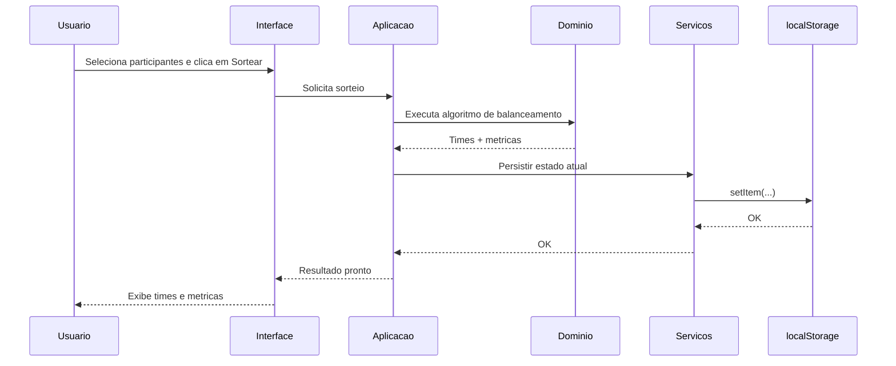

# Padroes de Comunicacao

> Ultima atualizacao: 2026-04-18
>
> Este documento descreve como os componentes do Team Drawer se comunicam.

## Visao Geral

O sistema opera majoritariamente com comunicacao sincrona in-process dentro da SPA. As unicas integracoes externas sao APIs de plataforma do navegador e o fluxo de entrega estatico via GitHub.

## Padroes de Comunicacao Utilizados

### Comunicacao Sincrona Interna

**Uso**: Interacao entre componentes de UI, camada de aplicacao, dominio e servicos locais.

**Padrao**:

- UI dispara acoes de caso de uso.
- Aplicacao orquestra chamada de dominio e servicos.
- Dominio retorna resultado e metricas para a UI.

**Decisoes Relacionadas**:

- [ADR 0002](../adr/0002-adopt-frontend-only-spa-architecture.md)
- [ADR 0004](../adr/0004-separate-domain-logic-from-ui.md)
- [ADR 0005](../adr/0005-adopt-heuristic-team-draw-balancing.md)

### Comunicacao com APIs de Plataforma do Navegador

#### localStorage API

**Uso**: Persistir cadastro e estado local relevante.

**Contrato**: Estrutura JSON validada antes de persistir.

**Falhas**: Tratar indisponibilidade ou erros de acesso e sinalizar usuario.

#### File API (Importacao/Exportacao)

**Uso**: Portabilidade de cadastro em JSON.

**Contrato**:

- Campos esperados: id, name, position, skillLevel.
- Conflito por nome: manter registro existente e sinalizar.

**Falhas**: Parse invalido e schema invalido interrompem importacao.

#### Clipboard API

**Uso**: Copia de texto padronizado com os dois times.

**Fallback**: Exibir textarea com texto pronto para copia manual.

**Decisoes Relacionadas**:

- [ADR 0003](../adr/0003-use-localstorage-and-json-portability.md)
- [ADR 0006](../adr/0006-define-json-import-conflict-policy.md)

### Comunicacao de Entrega (CI/CD)

**Uso**: Publicacao automatizada de build estatico.

**Padrao**: Push em main aciona workflow com build e deploy no GitHub Pages.

**Decisao Relacionada**:

- [ADR 0008](../adr/0008-deploy-static-app-with-github-pages-actions.md)

## Matriz de Comunicacao

| De / Para | UI | Aplicacao | Dominio | Servicos de Plataforma | Browser APIs |
|-----------|----|-----------|---------|-------------------------|--------------|
| **UI** | - | chamadas sync | indireto via aplicacao | indireto via aplicacao | - |
| **Aplicacao** | atualiza estado/visao | - | chamadas sync | chamadas sync | indireto via servicos |
| **Dominio** | retorna resultados via aplicacao | retorna resultados | - | - | - |
| **Servicos de Plataforma** | retorna status via aplicacao | retorna status | - | - | acesso direto |

## Fluxo de Sequencia Principal (Sorteio)

## Contratos e Schemas

### Contrato de Jogador (JSON)

- id: identificador unico.
- name: nome do jogador.
- position: Goleiro | Defesa | Meio | Atacante.
- skillLevel: inteiro entre 1 e 10.

### Politica de Conflito

- Deduplicacao por name.
- Em conflito: manter dado local e notificar usuario.

## Resiliencia e Tratamento de Falhas

- Sem retries de rede para regras centrais, por nao depender de backend.
- Validacao defensiva na importacao JSON.
- Feedback claro para erro de persistencia e clipboard.

## Observabilidade de Comunicacao

- Escopo atual sem tracing distribuido.
- Indicadores relevantes em desenvolvimento:
  - taxa de falha de importacao;
  - taxa de falha de copia para clipboard;
  - latencia percebida de sorteio.

## Seguranca na Comunicacao

- Nao ha autenticacao/autorizacao de API remota no escopo atual.
- Dados permanecem no dispositivo do usuario.
- Importacao JSON deve validar schema antes de mesclagem.

## Referencias

- [Visao Geral da Arquitetura](system-overview.md)
- [ADRs](../adr/README.md)
- [Indice Meta](../INDEX.md)
