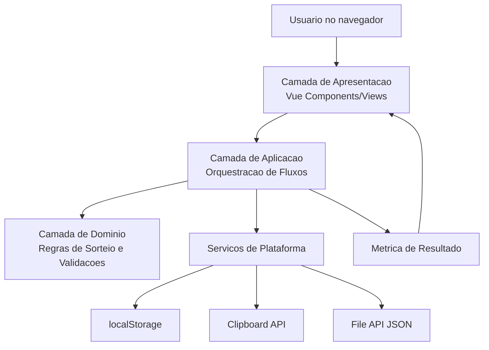

# Visao Geral da Arquitetura

> Ultima atualizacao: 2026-04-18
>
> Este documento descreve a arquitetura de alto nivel do Team Drawer.

## Diagrama de Arquitetura de Alto Nivel

## Componentes Principais

### Camada de Apresentacao

**Responsabilidade**: Renderizar UI, receber interacoes e exibir resultado do sorteio.

**Tecnologias**: Vue.js, Bootstrap.

**Decisoes Relacionadas**:

- [ADR 0001](../adr/0001-use-vue-vite-typescript-stack.md)
- [ADR 0009](../adr/0009-adopt-pt-br-ui-and-english-code-convention.md)

### Camada de Aplicacao

**Responsabilidade**: Orquestrar fluxos de cadastro, selecao, sorteio, importacao/exportacao e copia.

**Tecnologias**: TypeScript.

**Decisoes Relacionadas**:

- [ADR 0004](../adr/0004-separate-domain-logic-from-ui.md)

### Camada de Dominio

**Responsabilidade**: Aplicar regras de jogador, restricoes de sorteio e calculo de metricas.

**Tecnologias**: TypeScript com funcoes puras.

**Decisoes Relacionadas**:

- [ADR 0005](../adr/0005-adopt-heuristic-team-draw-balancing.md)

### Servicos de Plataforma

**Responsabilidade**: Encapsular acesso a APIs nativas do navegador.

**Tecnologias**: localStorage API, Clipboard API, File API.

**Decisoes Relacionadas**:

- [ADR 0003](../adr/0003-use-localstorage-and-json-portability.md)
- [ADR 0006](../adr/0006-define-json-import-conflict-policy.md)

### Entrega e Operacao

**Responsabilidade**: Build, testes e deploy estatico.

**Tecnologias**: Vite, Vitest, GitHub Actions, GitHub Pages.

**Decisoes Relacionadas**:

- [ADR 0007](../adr/0007-standardize-unit-testing-strategy.md)
- [ADR 0008](../adr/0008-deploy-static-app-with-github-pages-actions.md)

## Camadas Arquiteturais

### Camada 1: Apresentacao

**Responsabilidade**: Experiencia do usuario e interacoes da interface.

**Regra**: Nao concentrar regra de negocio complexa em componentes.

### Camada 2: Aplicacao

**Responsabilidade**: Encadear casos de uso e atualizar estado.

**Regra**: Depender do dominio e de servicos por interfaces claras.

### Camada 3: Dominio

**Responsabilidade**: Regras centrais e calculos de equilibrio.

**Regra**: Independente de framework de UI e API do navegador.

### Camada 4: Servicos de Plataforma

**Responsabilidade**: Integracao com APIs do browser e efeitos colaterais.

**Regra**: Isolar detalhes de plataforma da logica de dominio.

## Fluxo de Dados

1. Usuario cria/edita cadastro de jogadores.
2. Aplicacao valida e persiste dados localmente.
3. Usuario seleciona participantes da partida.
4. Dominio executa sorteio com restricoes e metricas.
5. UI mostra times e indicadores.
6. Usuario pode ressortear ou copiar resultado.

## Decisoes Arquiteturais Chave

- [ADR 0001](../adr/0001-use-vue-vite-typescript-stack.md)
- [ADR 0002](../adr/0002-adopt-frontend-only-spa-architecture.md)
- [ADR 0003](../adr/0003-use-localstorage-and-json-portability.md)
- [ADR 0004](../adr/0004-separate-domain-logic-from-ui.md)
- [ADR 0005](../adr/0005-adopt-heuristic-team-draw-balancing.md)

## Principios Arquiteturais

1. Simplicidade operacional: executar sem backend proprio.
2. Regras de dominio explicitas: manter criterio de sorteio e validacoes testaveis.
3. UX direta: fluxo curto para montar e compartilhar times.
4. Portabilidade de dados: permitir exportacao/importacao em JSON.

## Estrategias Transversais

### Tratamento de Erros

- Validacao preventiva de entrada.
- Tratamento explicito de falhas de parse e clipboard.

### Qualidade

- Testes unitarios como principal rede de seguranca.
- Cobertura minima definida em ADR.

### Seguranca

- Sem autenticacao/autorizacao no escopo atual.
- Dados locais sob controle do navegador do usuario.

## Evolucao da Arquitetura

- Estado atual: arquitetura inicial frontend-only para MVP funcional.
- Possivel evolucao: suporte a sincronizacao remota e colaboracao multiusuario mediante novos ADRs.

## Referencias

- [ADRs completos](../adr/README.md)
- [Padroes de Comunicacao](communication-patterns.md)
- [Documentacao funcional](../../docs/index.md)
